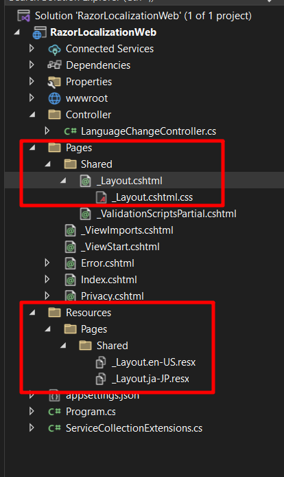

# Localization in ASP.NET Razor WebApp (No MVC)
This repository provides source code for the localization in AspNetCore Web App.

## Development Guidelines

### 1.Configuring Localization in ASP.NET Core
Most of the cross-cutting features in ASP.NET Core are configured using middleware and to configure localization we need to configure the RequestLocalizationMiddleware middleware. This middleware enables the automatic setting of the culture for HTTP requests based on the information sent by the client.

To configure localization middleware, open the Program.cs file and call the following AddLocalization method. The AddLocalization method adds the localization services to the services container. The ResourcePath property specifies the relative path under application root where the resource files are located.
```
builder.Services.AddLocalization(options =>
{
    options.ResourcesPath = "Resources";
});
```
We can also call **AddViewLocalization** method that adds support for localized view files which we will use later in this tutorial.
```
builder.Services.AddControllersWithViews()
    .AddViewLocalization();
```
Next, we need to define which cultures we want to support in our application and which one of those will be used as a default culture. 
```
builder.Services.Configure<RequestLocalizationOptions>(options =>
{
    options.DefaultRequestCulture = new RequestCulture("en-US");
 
    var cultures = new CultureInfo[]
    {
        new CultureInfo("en-US"),
        new CultureInfo("js-JP"),
        new CultureInfo("fr-FR")
    };
 
    options.SupportedCultures = cultures;
    options.SupportedUICultures = cultures;
});
```
The final configuration step is to enable the localization middleware using the UseRequestLocalization method.
```
app.UseRequestLocalization();
```
### 2.Resource Files Naming Conventions and Location
A resource (.resx) file allows us to separate the localizable resources e.g. strings, icons, images, etc. from the source code. To create resource files for different languages and cultures, we usually put the culture information in the file name. For example, if you are creating a resource file to store English language resources then the file name will be MyResourceFile.en.resx. If you want to create a separate resource file for US English, then the file name will be MyResourceFile.en-US.resx. To create a new resource file in Visual Studio, you can right-click on the folder where you want to create the resource file and choose Add > New Item option.
### 3.Using IViewLocalizer Service
To improve developer’s productivity, .NET Core introduces the concept of localized services. These services can be injected using the dependency injection and can provide you access to the resources saved in resource files. The three localizer services are:
* IStringLocalizer or IStringLocalizer<T>
* IHtmlLocalizer or IHtmlLocalizer<T>
* IViewLocalizer

The IViewLocalizer service provides localized strings for a view. When we are using the IViewLocalizer service, the resource file naming convention and the location become even more critical. This is because the default implementation of IViewLocalizer tries to find the resource file based on the view file name. This also means that you can’t use the global shared resource files with IViewLocalizer.

Our view file name is _Layout.cshtml so let’s create a resource file with the name _Layout.en-US.resx at Resources\Pages\Shared folder as shown in the following screenshot.



To use IViewLocalizer, inject it in the _Layout.cshtml file as shown in the code snippet below.
```
@using Microsoft.AspNetCore.Builder
@using Microsoft.AspNetCore.Localization
@using Microsoft.AspNetCore.Mvc.Localization;
@using Microsoft.Extensions.Options

@inject IViewLocalizer ViewLocalizer

<div class="text-center">
    <p>
        @ViewLocalizer["web.title"]
    </p>
</div>
```

### Switching Language in ASP.NET Core Applications
The first thing we need to do is to get the list of supported cultures so that we can display these cultures in a dropdown at the top of the page. Open the _Layout.cshtml file and add the following code snippet on top of the file.
```
@using Microsoft.AspNetCore.Builder
@using Microsoft.AspNetCore.Localization
@using Microsoft.Extensions.Options
 
@inject IOptions<RequestLocalizationOptions> LocOptions
 
@{
    string returnUrl = ViewContext.HttpContext.Request.Path;
 
    var requestCulture = Context.Features.Get<IRequestCultureFeature>();
    var cultureItems = LocOptions.Value.SupportedUICultures
        .Select(c => new SelectListItem { Value = c.Name, Text = c.DisplayName })
        .ToList();
}
```
The **Features** property of **HttpContext** provides access to the collection of feature interfaces for the current request. We are interested in the **IRequestCultureFeature** which represents the feature that provides the current request’s culture information.

To fetch the list of all supported cultures we configured in Startup.cs file at the start of this post, we are using RequestLocalizationOptions object. We are also creating a SelectListItem from the SupportedUICultures list so that we can bind the SelectListItem with the HTML select control.
```
var cultureItems = LocOptions.Value.SupportedUICultures
        .Select(c => new SelectListItem { Value = c.Name, Text = c.DisplayName })
        .ToList();
```
Next, we need to add a form in the top navigation bar that will bind the HTML select dropdown with the cultures using the asp-items property. The current culture name is also bound with the asp-for property to make sure the current culture is pre-select automatically on page refresh. I also used the onchange event to automatically submit the form to the ChangeLanguage action method that will do all the magic for us.  
```
<li class="nav-item">
    <form asp-action="ChangeLanguage" asp-controller="LanguageChange" method="post">
    <input type="hidden" id="returnUrl" name="returnUrl" value="@returnUrl" />
        <select id="culture"
                name="culture"
                class="form-control"
                onchange="this.form.submit();"
                asp-items="cultureItems"
                asp-for="@requestCulture.RequestCulture.UICulture.Name">
        </select>

    </form>
</li>
```

Because our project don't have MVC, so we need add controller service for our project. In Program.cs file:
```
// Add controller support
builder.Services.AddControllers();

...
...
...

app.MapControllers();
```

The **ChangeLanguage** action method of the **HomeController** class will receive the **culture** and the **returnUrl** as a parameter and its main job is to make a cookie with the currently selected culture and append it in the HTTP response cookies collection.
```
[HttpPost("ChangeLanguage")]
public IActionResult ChangeLanguage([FromForm]string culture, [FromForm] string returnUrl)
{
    Response.Cookies.Append(
        CookieRequestCultureProvider.DefaultCookieName,
        CookieRequestCultureProvider.MakeCookieValue(new RequestCulture(culture)),
            new CookieOptions
            {
                Expires = DateTimeOffset.UtcNow.AddDays(7)
            }
    );

    return LocalRedirect(returnUrl);
}
```